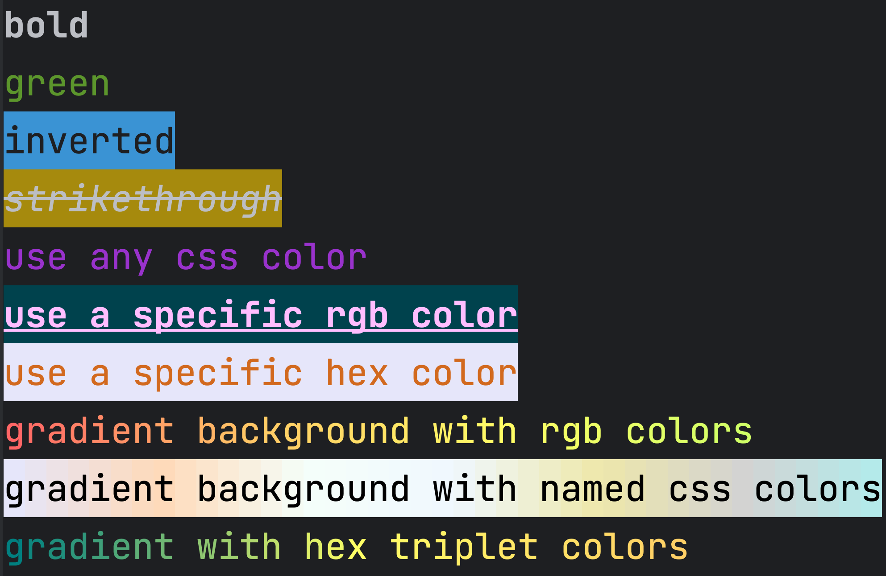

# 🖌️ Brush

> Scala Terminal String Styling

## Features
* Dependency free
* Apply multiple text styles
* Supports 256-color and Truecolor
* Gradient text styling
* Automatically detects color support and style accordingly



## Installation
To include Brush in your Scala project, add the following dependency:

```scala
libraryDependencies += "com.ranyitz" %% "brush" % "0.1.0"
```

## Usage
To start styling your terminal strings, simply import `brush._` in your Scala file:


```scala
import brush._
 
println("bold".bold)
println("green".green)
println("inverted".blue.inverse)
println("strikethrough".bgYellow.italic.strikethrough)
println("use any css color".color("darkorchid"))
println(
"use a specific rgb color"
    .bgRgb(0, 66, 77)
    .rgb(255, 190, 255)
    .bold
    .underline,
)
println(
"gradient background with rgb colors"
    .gradient(
    (255, 102, 102), // Red
    (255, 204, 102), // Orange
    (255, 255, 102), // Yellow
    (204, 255, 102), // Green
    ),
)
println(
"gradient background with named css colors"
    .bgGradient(
    "lavender",
    "peachpuff",
    "mintcream",
    "aliceblue",
    "palegoldenrod",
    "lightgray",
    "paleturquoise",
    )
    .black,
)
```

### Text Modifiers
Brush provides various text modifiers for customization:

* `bold` - Makes the text bold.
* `dim` - Applies lower opacity to the text.
* `italic` - Renders the text in italics.
* `underline` - Adds a horizontal line below the text.
* `inverse` - Inverts background and foreground colors.
* `strikethrough` - Strikes a horizontal line through the text's center.
* `overline` - Adds a horizontal line above the text.
* `reset` - Resets the current style.
* `hidden` - Prints the text invisibly.

### Text Colors

`black` | `red` | `green` | `yellow` | `blue` | `magenta` | `cyan` | `white` | `blackBright` | `gray` | `redBright` | `greenBright` | `yellowBright` | `blueBright` | `magentaBright` | `cyanBright` | `whiteBright`

### Background Colors

`bgBlack` | `bgRed` | `bgGreen` | `bgYellow` | `bgBlue` | `bgMagenta` | `bgCyan` | `bgWhite` | `bgBlackBright` | `bgGray` | `bgRedBright` | `bgGreenBright` | `bgYellowBright` | `bgBlueBright` | `bgMagentaBright` | `bgCyanBright` | `bgWhiteBright`

### 256 and Truecolor Support

* `rgb` | `truecolor` - choose a color by providing red, green, and blue values between 0 and 255.
* `bgRgb` | `bgTruecolor` - same as rgb, but for background colors.

```scala
println("Yellow Green".rgb(154, 205, 50))
println("Steel Blue".bgRgb(70, 130, 180))
```

### CSS Named Colors

* `css` | `color` - choose a color by providing a CSS color name.
* `bgCss` | `bgColor` - same as css, but for background colors.

```scala
println("(154, 205, 50)".css("yellowgreen"))
println("(70, 130, 180)".bgCss("steelblue"))
```

For a complete list of available colors, refer to the [full named colors list](https://developer.mozilla.org/en-US/docs/Web/CSS/named-color)

### Environment Variables
* `NO_COLOR` - If set to any value, disables all colors.
* `FORCE_COLOR` - If set to any value between `0`-`3`, forces the following color level:
    - `0` - All colors disabled.
    - `1` - Basic 16 colors support.
    - `2` - ANSI 256 colors support.
    - `3` - Truecolor 16 million colors support.

### Notes
Insperation were taken from the following projects:
* [chalk](https://github.com/chalk/chalk) (js)
* [colored](https://github.com/colored-rs/colored) (rust)
* [colored](https://github.com/defunkt/colored) (ruby)
* [rainbow](https://github.com/ktoso/scala-rainbow) (scala)
